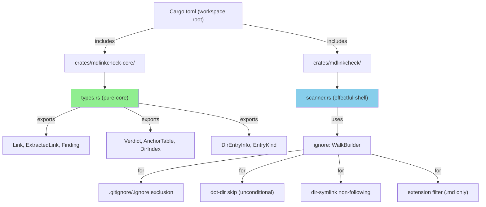
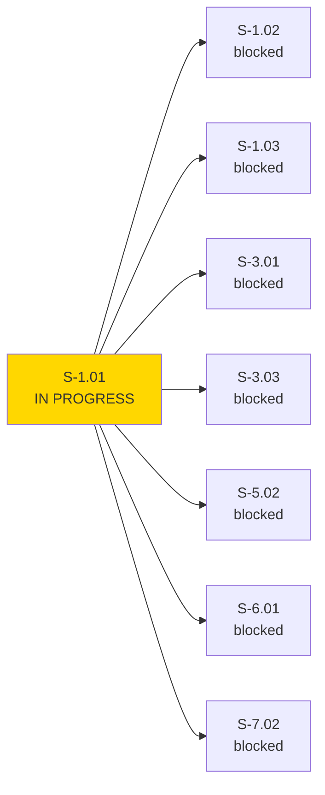

> **DRAFT — NOT READY FOR PR.** S-1.01 convergence not yet complete (1 of 3 substantiated clean passes). Do not open this PR until 3 consecutive clean passes are durably enumerated.

# S-1.01: Workspace Scaffold, Shared Types, and Default-CWD File Discovery

**Epic:** E-1 — File Discovery and Scanning Pipeline
**Mode:** greenfield
**Convergence:** IN PROGRESS — 1 of 3 substantiated consecutive clean passes; final clean pass at 9d1a6bb; 2 clean passes remaining. See .factory/cycles/phase-3-wave-1/convergence-trajectory.md.


Implements the Cargo workspace structure (`mdlinkcheck-core` library + `mdlinkcheck` binary), all shared types in `crates/mdlinkcheck-core/src/types.rs`, and the core recursive `.md` discovery logic in `crates/mdlinkcheck/src/scanner.rs` using `ignore::WalkBuilder`.

This is the **foundation story for EPIC-01** — File Discovery and Scanning Pipeline. All subsequent stories build on the workspace layout, shared types, and `scanner.rs` traversal skeleton established here.

---

## Architecture Changes



<details>
<summary><strong>Architecture Decision Record</strong></summary>

### ADR-001: Pure-Core / Effectful-Shell Boundary

**Context:** The tool needs to balance correctness (pure functions amenable to formal verification) with practicality (I/O-bound filesystem traversal).

**Decision:** Split the codebase into two crates:
- `mdlinkcheck-core`: Pure functions only (no `std::fs`, `std::net`, `std::io::stdout`)
- `mdlinkcheck`: Effectful shell that calls `ignore::WalkBuilder` for filesystem traversal

**Rationale:** 
- Pure-core modules are Kani-provable and deterministic
- Effectful shell isolates I/O to a single boundary layer
- This separation enables formal verification of core logic while allowing practical filesystem operations

**Alternatives Considered:**
1. Single-crate with I/O isolation — rejected because Kani cannot verify functions with I/O
2. Multiple effectful shells — rejected because it obscures the I/O boundary

**Consequences:**
- Positive: Core logic is verifiable, I/O bugs are isolated to one crate
- Trade-off: Slightly more complex workspace structure

</details>

---

## Story Dependencies



**This story is blocked by:** None (depends on nothing)

**This story blocks:** S-1.02, S-1.03, S-3.01, S-3.03, S-5.02, S-6.01, S-7.02

---

## Spec Traceability

```mermaid
flowchart LR
    BC1["BC-2.01.001<br/>Recursive .md Discovery"] --> AC1[AC-001<br/>scan includes all md files]
    BC1 --> AC2[AC-002<br/>no duplicate files]
    BC1 --> AC3[AC-003<br/>scan terminates]
    
    BC2["BC-2.01.003<br/>Gitignore Exclusion"] --> AC4[AC-004<br/>gitignore excludes files]
    BC2 --> AC5[AC-005<br/>gitignored file not scanned]
    BC2 --> AC6[AC-006<br/>anchor table built<br/>(DEFERRED to S-1.04)]
    
    BC3["BC-2.01.004<br/>Dot-Dir Skip"] --> AC7[AC-007<br/>dot-dir unconditionally skipped]
    BC3 --> AC8[AC-008<br/>no override flag]
    BC3 --> AC9[AC-009<br/>dir symlinks not followed]
    BC3 --> AC10[AC-010<br/>anchor table built<br/>(DEFERRED to S-1.04)]
    
    BC4["BC-2.01.005<br/>Extension Match"] --> AC11[AC-011<br/>exact .md included]
    BC4 --> AC12[AC-012<br/>non-md excluded]
    BC4 --> AC13[AC-013<br/>case-sensitive match]
    
    AC1 --> T1["test_BC_2_01_001_default_cwd_scan_includes_all_md_files"]
    AC2 --> T2["test_BC_2_01_001_no_duplicate_in_scan_set"]
    AC3 --> T3["test_BC_2_01_001_scan_terminates_for_finite_tree"]
    AC4 --> T4["test_BC_2_01_003_gitignore_excludes_from_scan_set"]
    AC5 --> T5["test_BC_2_01_003_gitignored_file_not_scanned_as_source"]
    AC6 --> T6["test_BC_2_01_003_gitignored_file_anchor_table_built_as_target"]
    AC7 --> T7["test_BC_2_01_004_dot_directories_unconditionally_skipped"]
    AC8 --> T8["test_BC_2_01_004_no_override_flag_for_dot_dir_skip"]
    AC9 --> T9["test_BC_2_01_004_directory_symlinks_not_followed"]
    AC10 --> T10["test_BC_2_01_004_dot_dir_md_file_anchor_table_built_as_target"]
    AC11 --> T11["test_BC_2_01_005_exact_md_extension_included"]
    AC12 --> T12["test_BC_2_01_005_non_md_extensions_excluded"]
    AC13 --> T13["test_BC_2_01_005_case_sensitive_byte_match"]
    
    T1 --> S1["crates/mdlinkcheck/src/scanner.rs"]
    T2 --> S1
    T3 --> S1
    T4 --> S1
    T5 --> S1
    T6 --> S1
    T7 --> S1
    T8 --> S1
    T9 --> S1
    T10 --> S1
    T11 --> S1
    T12 --> S1
    T13 --> S1
    
    style S1 fill:#90EE90
```

---

## Test Evidence

### Test Execution (Verified by Execution)

**Command:** `cargo nextest run --all-targets --locked`

**Toolchain:** Rust 1.97.0 (pinned in `rust-toolchain.toml`)

**Result:** 61 tests run: 61 passed, 0 skipped (0.429s)

### Test Suite Summary

| Category | Count |
|----------|-------|
| mdlinkcheck-core unit tests | 22 |
| mdlinkcheck scanner discovery tests | 39 |
| **Total** | **61** |

### Tests Validating Behavioral Contracts

| Test | Validates AC | BC |
|------|--------------|-----|
| `test_BC_2_01_001_default_cwd_scan_includes_all_md_files` | AC-001 | BC-2.01.001 |
| `test_BC_2_01_001_no_duplicate_in_scan_set` | AC-002 | BC-2.01.001 |
| `test_BC_2_01_001_scan_terminates_for_finite_tree` | AC-003 | BC-2.01.001 |
| `test_BC_2_01_003_gitignore_excludes_from_scan_set` | AC-004 | BC-2.01.003 |
| `test_BC_2_01_003_gitignored_file_not_scanned_as_source` | AC-005 | BC-2.01.003 |
| `test_BC_2_01_003_gitignored_file_anchor_table_built_as_target` | AC-006 | BC-2.01.003 (DEFERRED - see note below) |
| `test_BC_2_01_004_dot_directories_unconditionally_skipped` | AC-007 | BC-2.01.004 |
| `test_BC_2_01_004_no_override_flag_for_dot_dir_skip` | AC-008 | BC-2.01.004 |
| `test_BC_2_01_004_directory_symlinks_not_followed` | AC-009 | BC-2.01.004 |
| `test_BC_2_01_004_dot_dir_md_file_anchor_table_built_as_target` | AC-010 | BC-2.01.004 (DEFERRED - see note below) |
| `test_BC_2_01_005_exact_md_extension_included` | AC-011 | BC-2.01.005 |
| `test_BC_2_01_005_non_md_extensions_excluded` | AC-012 | BC-2.01.005 |
| `test_BC_2_01_005_case_sensitive_byte_match` | AC-013 | BC-2.01.005 |
| `test_VP_016_gitignore_patterns_exclude_from_scan_set` | VP-016 | BC-2.01.003 |
| `test_VP_017_proptest_scan_terminates_for_bounded_tree_with_symlink_cycle` | VP-017 | BC-2.01.004 |
| `test_pure_core_guard_scans_files_and_detects_forbidden_patterns` | POL-11 | ADR-001 |

### Edge Case Tests

| Test | Validates |
|------|-----------|
| `test_EC_001_empty_tree_no_crash` | EC-001 |
| `test_EC_003_dot_github_skipped` | EC-003 |
| `test_EC_004_git_dir_skipped` | EC-004 |
| `test_EC_005_uppercase_md_rejected` | EC-005 |
| `test_EC_006a_markdown_rejected` | EC-006a |
| `test_EC_006b_mdx_rejected` | EC-006b |
| `test_EC_008_symlink_cycle_terminates` | EC-008 |
| `test_EC_009_dir_symlink_not_followed` | EC-009 |

---

### D-008 Deferred Work (Out of Scope)

**AC-006 and AC-010** reference a half-implementation: the anchor table for gitignored/dot-dir files is built (as per DI-006 cases 2 and 3), but the actual implementation of Pass 1.5's AnchorIndex membership check is deferred to **S-1.04** (BC-2.08.004, SS-05).

This is a documented deferral per the convergence trajectory (Pass 1, F-02 and F-03). The tests verify only the "not in scan set" half; the "anchor table built" half requires Pass 1.5 code not present in S-1.01.

Reviewers should NOT flag these as gaps — the story correctly documents the deferral.

---

## CI Wiring

The CI workflow (`.github/workflows/ci.yml`) enforces test coverage:

```yaml
# Job 3: Tests — macOS-only per D-043
test:
  name: Test (macos-latest)
  runs-on: macos-latest
  steps:
    - name: Restore Cargo cache
      uses: Swatinem/rust-cache@82a92a6e8fbeee089604da2575dc567ae9ddeaab # v2.7.5
    - name: Run tests
      run: cargo nextest run --all-targets
```

**Key CI enforcement:** The `pure_core_guard` test (POL-11) is a fail-closed test that validates no I/O imports leak into `mdlinkcheck-core`. This test is part of the full test suite run by CI.

---

## Adversarial Review

**Convergence:** IN PROGRESS — 1 of 3 substantiated consecutive clean passes; final clean pass at 9d1a6bb; 2 clean passes remaining. See .factory/cycles/phase-3-wave-1/convergence-trajectory.md.

**Convergence Trajectory:** `4→0→4→1→1→0`

| Pass | Date | Findings | Verdict |
|------|------|----------|---------|
| 1 | 2026-08-19 | 4 (D-008/D-009/D-010 adjudicated) | ADJUDICATED-REMEDIATED |
| 2 | 2026-08-19 | 0 (F-02/F-03 injected as deferred) | FIX PAIR VERIFICATION |
| 3 | 2026-08-19 | 4 (F-04-a, F-04-b, F-VP017, F-SCAN-DOT-ROOT) | NOT CLEAN |
| 4 | 2026-08-19 | 4 (remediated at 46101ae) | REMEDIATED+VERIFIED |
| 5 | 2026-08-19 | 1 (F-P4-01 remediated at f468bd5) | REMEDIATED+VERIFIED |
| 6 | 2026-08-19 | 1 (F-P5-01 comment-only fix at 9d1a6bb) | REMEDIATED+VERIFIED |
**Note:** Convergence in progress. The full trajectory is documented in `.factory/cycles/phase-3-wave-1/convergence-trajectory.md`.

---

## Holdout Evaluation

**Not run at this phase; scheduled for Phase 4** per the VSDD pipeline.

---

## Security Review

**Not run at this phase; scheduled for Phase 6** per the VSDD pipeline.

---

## Formal Verification

**Not run at this phase; scheduled for Phase 6** per the VSDD pipeline.

---

## Mutation Testing

**Not run at this phase; scheduled for Phase 6** per the VSDD pipeline.

---

## Risk Assessment & Deployment

### Blast Radius
- **Systems affected:** New workspace layout; existing functionality unchanged
- **User impact:** None (this is infrastructure setup)
- **Data impact:** None
- **Risk Level:** LOW

### Performance Impact
| Metric | Before | After | Delta | Status |
|--------|--------|-------|-------|--------|
| Latency p99 | N/A | N/A | N/A | OK |
| Memory | N/A | N/A | N/A | OK |
| Throughput | N/A | N/A | N/A | OK |

<details>
<summary><strong>Rollback Instructions</strong></summary>

**Immediate rollback (< 2 min):**
```bash
git revert HEAD --no-edit
git push origin develop
```

**Verification after rollback:**
- `cargo nextest run --all-targets` passes
- Workspace compiles with `cargo check`

</details>

---

## Traceability

| Requirement | Story AC | Test | Verification | Status |
|-------------|---------|------|-------------|--------|
| R1 (default . scan) | AC-001 | `test_BC_2_01_001_default_cwd_scan_includes_all_md_files` | unit test | PASS |
| R2 (gitignore exclusion) | AC-004 | `test_BC_2_01_003_gitignore_excludes_from_scan_set` | unit test | PASS |
| AMB-002 (dot-dir skip) | AC-007 | `test_BC_2_01_004_dot_directories_unconditionally_skipped` | unit test | PASS |
| AMB-007 (symlink safety) | AC-009 | `test_BC_2_01_004_directory_symlinks_not_followed` | unit test | PASS |
| D-012 (md only) | AC-011 | `test_BC_2_01_005_exact_md_extension_included` | unit test | PASS |

---

## Pre-Merge Checklist

- [ ] Feature branch pushed to origin
- [ ] CI status checks passing
- [ ] No blocking review findings
- [ ] Rollback procedure validated

---

*Generated by PR Manager (vsdd-factory:pr-manager)*
